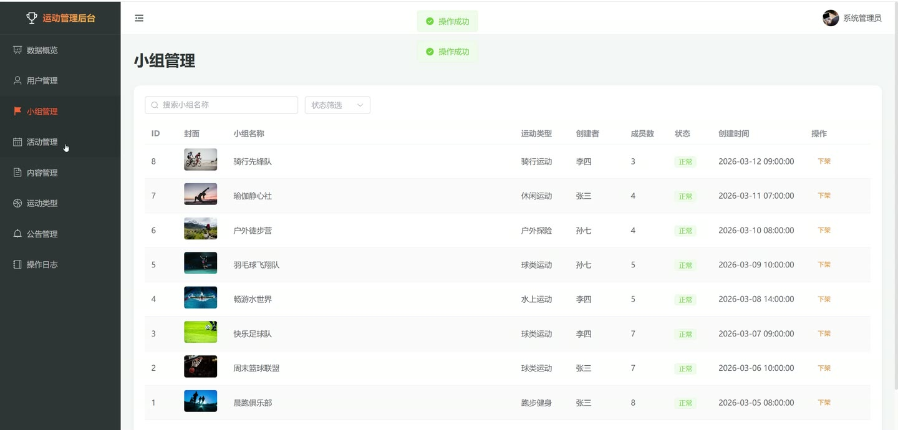
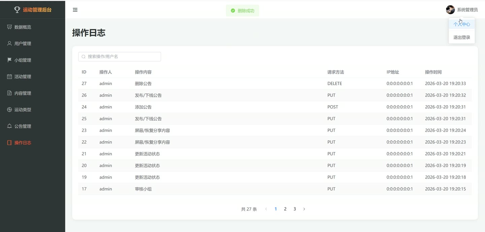

# (附文档)Springboot3+Vue3+MySQL 趣味运动兴趣小组管理系统

**技术栈**：Springboot3、Vue3、MySQL

### 系统简介

趣味运动兴趣小组管理系统是一个前后端分离的社区化平台，支持普通用户、小组管理员和系统管理员三种角色。系统围绕运动兴趣小组的创建与管理、活动发布与报名、内容分享与互动三大核心场景设计，提供从用户注册登录到小组申请、活动参与、内容发布、评论点赞、后台审核的完整闭环。
 
### 核心功能
 
### 普通用户端

 
- 用户注册与登录：通过用户名+密码注册账号，支持注册为普通用户或小组管理员（需后台审核），登录后获取 JWT 令牌 
- 浏览运动类型：查看系统预设的运动分类列表（如篮球、跑步、瑜伽等），支持按排序字段升序展示 
- 查看推荐小组：首页展示成员数最多的 6 个热门小组，支持按名称/描述关键词搜索、按运动类型筛选 
- 查看小组详情：查看小组名称、简介、封面图、运动类型、成员数、创建者昵称等完整信息 
- 申请加入小组：向目标小组提交加入申请，系统自动检查是否已是成员或已有待审核申请 
- 查看推荐活动：首页展示最新发布的 6 个可报名活动，支持按标题/描述/地点关键词搜索、按小组筛选 
- 查看活动详情：查看活动标题、地点、开始/结束时间、最大人数、当前已报名人数、创建者信息 
- 报名与取消活动：在活动详情页一键报名（检查人数上限），支持取消报名并实时更新参与人数 
- 浏览分享内容：查看所有用户发布的图文分享，支持按标题/内容关键词搜索、按小组筛选 
- 查看分享详情：查看分享的完整图文内容、发布者昵称/头像、所属小组名称、点赞/收藏/评论数 
- 点赞与收藏分享：在分享详情页进行点赞/取消点赞、收藏/取消收藏操作，实时更新计数 
- 发表与删除评论：对分享内容发表评论（支持嵌套回复），可删除自己的评论，评论数自动更新 
- 查看系统公告：浏览已发布的系统公告列表，按时间倒序排列 
- 个人中心：查看/修改个人资料（昵称、头像、邮箱、手机、性别、简介），修改登录密码（需验证旧密码） 
- 我的小组：查看已加入的小组列表和已创建的小组列表 
- 我的活动：查看已报名的活动列表，按开始时间倒序排列 
- 我的分享：管理自己发布的分享列表（支持分页查看），可删除分享 
- 我的收藏：查看已收藏的分享列表（支持分页查看），可取消收藏
 
### 小组管理员端

 
- 创建兴趣小组：填写小组名称、简介、封面图、选择运动类型，创建后自动成为小组管理员 
- 编辑小组信息：修改已创建小组的名称、简介、封面图等基本信息 
- 查看成员列表：查看小组内所有已通过审核的成员（昵称、头像、用户名、角色） 
- 审核加入申请：查看待审核的申请列表，可选择通过或拒绝申请，通过后自动增加小组成员数 
- 移除小组成员：从小组中移除指定成员，自动减少小组成员数 
- 创建活动：为小组创建新活动，设置标题、描述、地点、开始/结束时间、最大参与人数 
- 编辑活动：修改已创建活动的标题、时间、地点等基本信息 
- 查看活动报名人员：查看已报名活动的用户列表（用户ID、昵称、头像、报名时间） 
- 发布分享：以小组名义发布图文分享内容（标题、内容、图片），关联到指定小组 
- 检查权限：通过接口验证当前用户是否为指定小组的管理员
 
### 管理员端

 
- 仪表盘数据概览：查看用户统计（总用户数/活跃/禁用/小组管理员数）、小组统计（总数/活跃/按类型分布）、活动统计（总数/进行中/已结束/总报名人次）、内容统计（总分享/活跃/屏蔽/总点赞/总收藏） 
- 用户管理：分页查询用户列表（不显示管理员），支持按用户名/昵称/手机号搜索，按状态筛选，可封禁或解封用户 
- 小组管理：分页查询所有小组，支持按名称搜索、按状态筛选，可审核上架或下架小组 
- 运动类型管理：新增运动类型（名称、排序顺序），编辑已有类型，删除类型 
- 活动管理：分页查询所有活动，支持按标题搜索、按状态筛选，可变更活动状态（取消/正常/结束） 
- 内容管理：分页查询所有分享内容，支持按标题搜索、按状态筛选，可屏蔽或恢复分享内容 
- 公告管理：分页查询公告列表，支持按标题搜索，可新增/编辑/删除公告，可发布或下线公告 
- 操作日志管理：分页查询系统操作日志（操作名称、操作用户、请求方法、参数、IP、时间），支持按操作名/用户名搜索
 
### 技术栈

 后端框架Spring Boot 3 ORMMyBatis-Plus 权限认证Spring Security + JWT 前端框架Vue 3 状态管理Vuex / Pinia 构建工具Vite 数据库MySQL 分页插件MyBatis-Plus Pagination 密码加密BCryptPasswordEncoder 文件上传MultipartFile + UUID 重命名
 
### 交付内容

 
- 后端完整源码 
- 前端完整源码 
- 数据库初始化脚本 
- 万字文档

## 界面展示

---

## 获取完整源码 + 万字文档

本仓库为项目介绍页。**完整前后端源码、数据库初始化脚本、万字项目文档**，请加微信 `kangkangcode`，或访问 [codekk.top](http://codekk.top) 获取。

可作课程设计 / 毕业设计参考，支持远程部署调试。